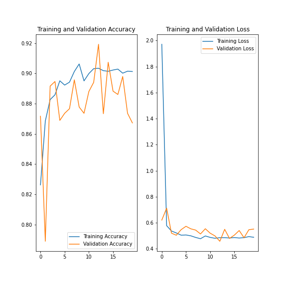

# TSI_classifier (in the making...)
A short guide on how to build a convolutional neural network to classify images from the Total Sky Imager on Summit Station, Greenland, in fogbow/icebow/nobow

## Introduction
This short guide is a result from a summer internship completed in 2021 at [SENSE - Centre for Satellite Data in Environmental Science](https://eo-cdt.org) at the University of Leeds under supervision from Dr Ryan R. Neely and Heather Guy. The overall goal of the project was to investigate Greenlandic fog, and we decided to use the large amount of photos from the Total Sky Imager to make a timeseries of when fog occurred and whether it formed by liquid or frozen droplets. 

To solve this problem I decided to try applying a convolutional neural network, and as a undergraduate student with some coding but no machine learning experience, the learning curve has been steep. The methods presented in this project is very likely **not** the best practice and someone with a ML/data science background might get a headache from reading it, but it is the product of my 6 weeks of learning deep learning and it solves the problem in a reasonable manner. 

Should you have any suggestions or questions, please do get in contact on tor.sorensen.18@ucl.ac.uk or elsewhere. Let's get going!

## System requirements

The work has been done in Python (3.7.10) on a Jupyter Notebook using Tensorflow (2.5.0), Keras and a bit of scikit-learn (0.24.2). Other used packages are numpy (1.21.1), matplotlib (3.3.4), os, PIL (8.3.1), pathlib and shutil. A full list of packages installed in the environment is in the file environment.txt.

## Data

The images analysed are taken by the [Total Sky Imager (TSI)](ftp://ftp1.esrl.noaa.gov/psd3/arctic/summit/tsi/0_docs/Summit_Datagrams_totalskyimager.pdf) on the Summit Station, Greenland, an instrument run from the roof of the ICECAPS Observatory. Below are three examples of photos taken by the TSI, one with a fogbow, one with frozen fogbow and one without any bow:

  

A small training dataset of 218 labeled photos is available under /data/training. The full training set of 18129 labeled photos are found in /data/training_full. A further test dataset is provided under /data/test, consisting of 214 labeled photos.

A log of the dates of data that has been used in training the model is found in training_datasets.txt.

## Code

I present two different approaches for building the neural network: Training a model from scratch and utilising transfer learning. As of now, I have had best success with the transfer learning approach using the Xception model as base, but the possibilities are endless so better results can most likely be found if using other models. I owe a massive thanks to the enormous amount of guides, tutorials and examples found online which I've massively copy-pasted from, especially the guides by [Keras](https://keras.io/guides/). While I'm at it, thanks to my old friend [Max Hipperson](https://www.ucl.ac.uk/astrophysics/max-hipperson-phd-student) from the "Extrasolar Planets" research group at UCL for a gentle introduction to ML and lots of links.

The code for transfer learning + fine-tuning is found in the transfer.ipynb file.

The code for building a model from scratch is found in the classifier.ipynb file.

Code for loading an already trained model and predicting on data is found in the predictor.ipynb file.

The codes for transforming the CSV files to Xarray and from there to NetCDF-file is found in CSV_to_xarray_and_plot.ipynb. The file also contains some example plots of how the data can be analysed. 

The file predict_functions.py contains supporting functions used in all notebooks. A rough description of their functions are found at the end of the transfer.ipynb file.

## Results

The best results have shown from the transfer learning approach with fine tuning. The best model is saved in /saved_models/final_model. It was set up in the transfer.ipynb-file and has undergone 13 epochs of transfer learning and 20 epochs of finetuning, and had a validation loss of 0.1363 and validation accuracy of 0.9842.

Loss and accuracy graphs were not obtained for all training due to interruption in training, but the graphs for the transfer learning part is shown hereunder:

The final model is in saved_models/final_model

## Uncertainties

To assess the uncertainties of the final model, I have first predicted the classification of 272 random dates (out of a total ≈1300) and then selected 100 random images from each classification for each of the decile interval of confidence that contains 100 images, and manually evaluated the classifications. No predictions had prediction confidence below 30% (below 33% is theoretical impossible for a 3 class problem) or above 60% (57.61% was highest at evaluation time). The result of this is presented in following confusion matrix and classification report:

### 30-40%

CONFUSION MATRIX 

|True\Prediction|Fog|Ice|None|
|-----------|-----------|-----------|-----------|
|Fog |25|1 |2 |
|Ice |8 |24|18|
|None|67|75|80|
 
CLASSIFICATION REPORT

||Accuracy|Recall|F1|
|-----------|-----------|-----------|-----------|
|Fog |0.25|0.89|0.39|
|Ice |0.24|0.48|0.32|
|None|0.80|0.36|0.50|

### 40-50%

CONFUSION MATRIX 

|True\Prediction|Fog|Ice|None|
|-----------|-----------|-----------|-----------|
|Fog |17|0 |3 |
|Ice |5 |37|15|
|None|78|63|82|

CLASSIFICATION REPORT

||Accuracy|Recall|F1|
|-----------|-----------|-----------|-----------|
|Fog |0.17|0.85|0.28|
|Ice |0.37|0.65|0.47|
|None|0.82|0.37|0.51|

### 50-60%

CONFUSION MATRIX 

|True\Prediction|Fog|Ice|None|
|-----------|-----------|-----------|-----------|
|Fog |60|0 |0 |
|Ice |0 |67|1 |
|None|40|33|99|

CLASSIFICATION REPORT

||Accuracy|Recall|F1|
|-----------|-----------|-----------|-----------|
|Fog |0.60|1.00|0.75|
|Ice |0.67|0.99|0.80|
|None|0.99|0.58|0.73|

## Improving the classifier

While the final classifier is useful there is still room for improvement. Here is a list of my ideas for improving the model, which should all be possible given time:

* Adding more training data
* Cropping out the 'interesting' part of the image (but take care as instrument is reinstalled every year the sky-part of the image change position)
* If cropped and centred: rotate so that sun is always at the same place
* Try different pre-trained models
* Continue training for longer
* Building custom model

<table>
<tr><th>Table 1 Heading 1 </th><th>Table 1 Heading 2</th></tr>
<tr><td>

|Table 1| Middle | Table 2|
|--|--|--|
|a| not b|and c |

</td><td>

|b|1|2|3| 
|--|--|--|--|
|a|s|d|f|

</td></tr> </table>